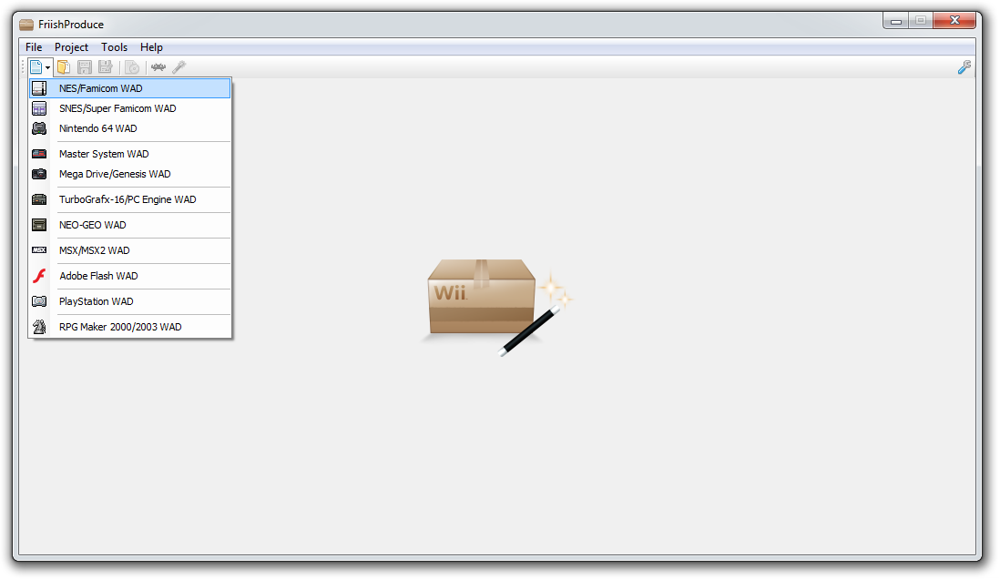
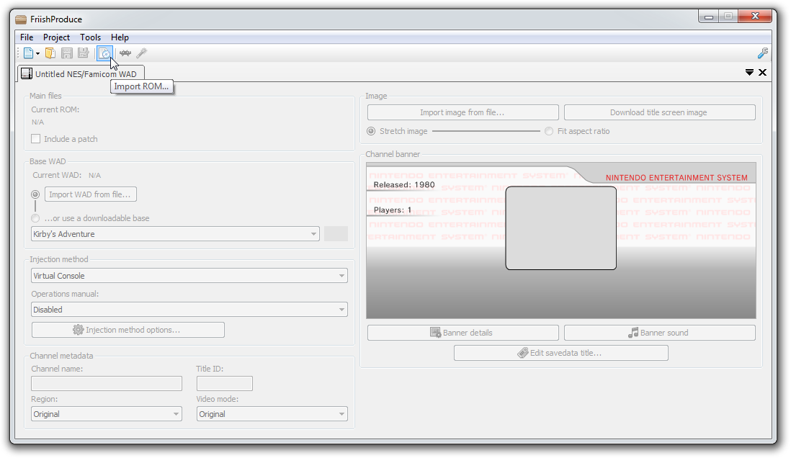
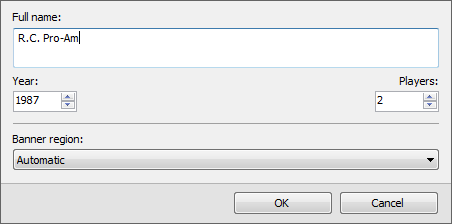
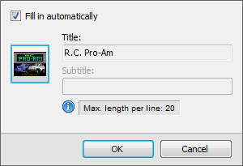
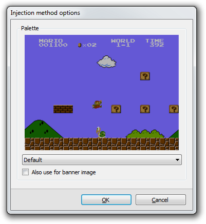
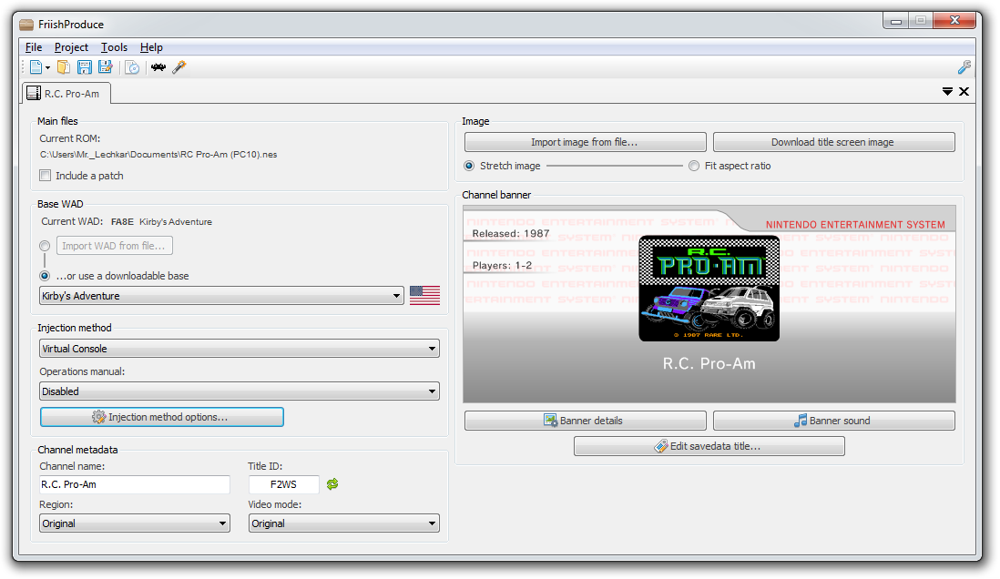

## Getting started

!!! warning ""
	
	**The following minimum requirements are needed:**
	
	* **OS:** Windows 7 or later
	* **Redistributables:**
		* .NET Framework 2.0 (needed for libWiiSharp)
		* .NET Framework 4.7.2
		* Microsoft Visual C++ Redistributable for Visual Studio 2019 (needed for ccf-tools)

!!! note ""
	
	Your browser or antivirus software may flag FriishProduce as a false positive. The latest compiled prerelease available on GitHub includes a link to an automatic VirusTotal analysis.
		
!!! info ""
	
	If you want to change any additional settings in the app, go to [Configuration](configuration.md).

1. [Download the latest release from GitHub](https://github.com/CatmanFan/FriishProduce/releases).
2. Install all listed redistributables if you haven't yet already. This will ensure that the program functions properly.
3. Extract the archive that you downloaded, then open `FriishProduce.exe`.
	* If this is your first time using the app, it will need to set itself up properly, including creating a configuration file.

## Creating a project

!!! info ""
	
	If you are unfamiliar over what a control does, hover over it on the GUI to see a short explanation.

!!! note ""
	
	As an example, this will demonstrate how to create an inject of an NES game. This will be similar for other supported consoles, and injection methods.

### Section I - Providing a game file

1. Open the `New...` dropdown menu, then select a console. This will create an empty project.

	{ loading=lazy; width="600"; }
	
2. Click `Import ROM...` (*the disc icon*), and open your game file. The button will be named differently depending on the console type (e.g. "disc image" for disc-based consoles, "SWF" for Flash, etc.).

	{ loading=lazy; width="600"; }

!!! info ""
	
	Alternatively, you can simply drag the game file and drop it over the interface, and it will automatically create the project for you.

### Section II - Required steps

#### Base WAD

Add a base WAD to use to inject into. You can do this by:

* Clicking `Import WAD from file...` and browsing for your local WAD file, or

* Checking the option to use a downloadable base, and selecting your preferred WAD from the dropdown list. You can also change the region by clicking on the flag next to it. 
  (If you are unable to access this option, you can enable it in the settings.)

#### Image

Add an image, usually the title screen of the game. You can do this by clicking:

* `Import image from file...`, then opening an image file, or

* `Download title screen image`, which will automatically download the title screen image if it is found.

#### Game title, year and players

1. Fill in the `Channel name` text field with your game's title. If it is too long, use a shortened version of 20 characters or less (e.g. "Zelda: Ocarina").
	
2. Open the banner details section by clicking on `Banner details`. Enter the full title of your game, the year which it was published and the number of players it supports. Click OK.
	
	{ loading=lazy; }
		
3. If the corresponding button is enabled, go to `Edit savedata title...`, then enter the title of your game, or a shortened version thereof not exceeding the available amount of characters. You can also choose to fill in these fields automatically, based on the channel title and the second line of your banner title.
	
	{ loading=lazy; }
		
!!! note ""
	
	You can choose to scan and prefill available game information (the full game name, year, players and title screen image) by clicking on the LibRetro icon. If you have turned on the `Automatically prefill game data after opening` option, this will be done automatically.
		
### Section III - Optional steps

These are extra features mainly for customization purposes, and you can tailor any of these to your liking or leave them as they are.

#### Injection method

You can change the injection method (use either Virtual Console/the official emulator or a .DOL forwarder) from the `Injection method` dropdown list. If you're creating a forwarder, you can specify where to store your emulator files using the `Root storage device` dropdown list.

If the corresponding button is enabled, go to `Injection method options...`. From this section, you can change the emulator's settings.

{ loading=lazy; }

#### WAD's target region and video mode

You can change the WAD's target region and the video mode that it will use by default. This can be useful to avoid the "This channel cannot be used." message when opening the WAD on a region-locked Wii console it is not meant for.

#### Banner sound

You can specify a sound file to use as the banner by clicking on `Banner sound > Replace banner sound...`, then browsing a WAV file to use.

### Section IV - Saving or exporting
	
Once you're done, your project will look something like this:

{ loading=lazy; width="600" }
	
You can save your project to a file to leave it for later. To export it as a WAD (or a ZIP archive for forwarders), click on `Export...` (*the magic wand icon*), and specify a filename and location to save to.

!!! success ""
	
	If all goes well, you should be able to install your WAD using your preferred WAD manager. For exported ZIPs, extract the contents of the archive to your SD/USB root (but not the empty .txt file telling you to do so), then install the provided WAD.

## Manual
		
!!! warning ""

	**Make sure your base manual matches that of your WAD's target console & region.** 
	Otherwise, the manual may fail to load and instead return a 404 error page similar to what is found in a [Wii semibrick](https://wii.hacks.guide/bricks.html#semibrick). This may occur if you have imported an incorrect manual folder or if it is unable to find the starting HTML.
	
	{ loading=lazy; width="350" }

## Project settings & content options
* You can **choose which base channel to use** to inject into, and which region of said channel, or you can **get a separate offline WAD file** to use instead. Some VC bases may have different compatibility or more features than other VC bases.
* When selecting a ROM, in certain instances you can also optionally **add a patch file** (.ips / .bps / .xdelta). Clicking the Import patch checkbox in the ROM information section will open a browse file dialog where you can search for your desired patch file, after which it will be applied to the ROM itself when it's injected.
* You can also edit some of the other options available, such as your **image's interpolation mode**, the **WAD title ID**, or the **content options for the current injection method** (clicking on the gear icon next to the methods list will open up a separate options menu).
* You can also import a **[custom VC manual with edited HTML and/or image files](vc-manual.md)** tailed to your game, use the original manual, or use none altogether.
* If you want to avoid using Virtual Console altogether, you can **change the injection method and use an emulator forwarder** instead in the content options section.
* You can **change the WAD region**.

----

!!! note ""
	
	**Please be sure to read the [FAQ](faq.md) if you encounter any issues.**

!!! tip ""
	
	Back to **[Home](index.md)**.