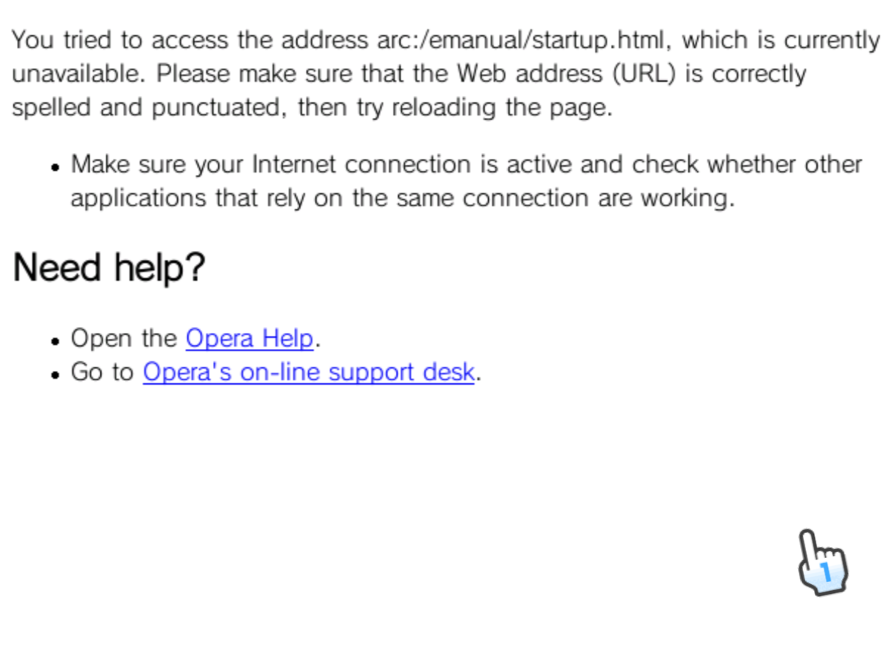

## Getting started

!!! warning ""
	
	The following minimum requirements are needed in order to run the program:
	
	* **OS:** Windows 7 or later
	* **Redistributables:**
		* .NET Framework 2.0 (needed for libWiiSharp)
		* .NET Framework 4.7.2
		* Microsoft Visual C++ Redistributable for Visual Studio 2019 (needed for ccf-tools)

!!! note ""
	
	Your browser or antivirus software may flag FriishProduce as a false positive. The latest compiled prerelease available on GitHub includes a link to an automatic VirusTotal analysis.
		
!!! info ""
	
	If you want to change any additional settings in the app, go to [Configuration](configuration.md).

1. [Download the latest release from GitHub](https://github.com/CatmanFan/FriishProduce/releases).
2. Install all listed redistributables if you haven't yet already. This will ensure that the program functions properly.
3. Extract the archive that you downloaded, then open `FriishProduce.exe`.
	* If this is your first time using the app, it will need to set itself up properly, including creating a configuration file.

## Creating a project

!!! info ""
	
	If you are unfamiliar over what a control does, hover over it on the GUI to see a short explanation.

!!! note ""
	
	As an example, this will demonstrate how to create an inject of an NES game. This will be similar for other supported consoles, and injection methods.

1. Open the "New..." dropdown menu, then select a console. An empty project will open.
2. Click "Open game file...", and import your ROM or ISO file.
3. **Required steps:**
	* Add a base WAD to use. You can do this by:
		* Clicking `Import WAD from file...` and browsing for your local WAD file, or
		* Checking the option to use a downloadable base, and selecting the preferred WAD name and region of your choice. If you are unable to access this option, you can enable it in the settings.
	* Add an image. You can do this by clicking:
		* `Import image from file...`, then importing an image file, or
		* `Download title screen image`, which will automatically download the title screen image if it is found.
	* Fill in all the text fields.
		1. Use a shortened version of your game title for the channel's name.
		2. Open the banner details section by clicking on `Banner details`. Enter the full title of your game, the year which it was published and the number of players it supports. Click OK.
		* You can choose to scan and prefill available game information by clicking on the LibRetro icon. If you have turned on the `Automatically prefill game data after opening` option, this will be done automatically.
	* If it is enabled, go to `Edit savedata title...`, then enter the title of your game, or a shortened version thereof not exceeding the available amount of characters.
		* You can choose to fill in these fields automatically, based on the channel title and the second line of your banner title.
4. **Optional steps:** (mainly for customization)
	* If it is enabled, go to `Injection method options...`, and change any of the available options based to your liking.
	* Specify a sound file to use as the banner by clicking on `Banner sound > Replace banner sound...`, then browsing a WAV file to use.
5. Click on the Export button, and save your WAD/ZIP.

!!! success ""
	
	You can now install it using your preferred WAD manager, or extract the contents of the ZIP archive to your SD/USB root.

## Manual
		
!!! warning ""
	
	Make sure your base manual matches that of your WAD's target console & region. Otherwise, the manual may fail to load and instead return a 404 error page similar to what is found in a [Wii semibrick](https://wii.hacks.guide/bricks.html#semibrick). This may occur if you have imported an incorrect manual folder or if it is unable to find the starting HTML.
	
	{ loading=lazy; width="350" }

## Project settings & content options
* You can **choose which base channel to use** to inject into, and which region of said channel, or you can **get a separate offline WAD file** to use instead. Some VC bases may have different compatibility or more features than other VC bases.
* When selecting a ROM, in certain instances you can also optionally **add a patch file** (.ips / .bps / .xdelta). Clicking the Import patch checkbox in the ROM information section will open a browse file dialog where you can search for your desired patch file, after which it will be applied to the ROM itself when it's injected.
* You can also edit some of the other options available, such as your **image's interpolation mode**, the **WAD title ID**, or the **content options for the current injection method** (clicking on the gear icon next to the methods list will open up a separate options menu).
* You can also import a **[custom VC manual with edited HTML and/or image files](vc-manual.md)** tailed to your game, use the original manual, or use none altogether.
* If you want to avoid using Virtual Console altogether, you can **change the injection method and use an emulator forwarder** instead in the content options section.
* You can **change the WAD region**.

## Finishing
Once you're done, click on the box icon and choose a location and/or filename to save your WAD to. If you are creating a forwarder, this will also create a separate ZIP file in the same path, which you will have to extract to your Wii SD or USB root (the WAD will not work otherwise).
If you encounter any issues with the current version, please feel free to notify at the FriishProduce GitHub repo, or on its release thread on GBAtemp.

In case you prefer to change any of the details you have later, you can also choose to save your project by clicking on the floppy disk icon.

----

!!! tip ""
	
	Back to **[Home](index.md)**.